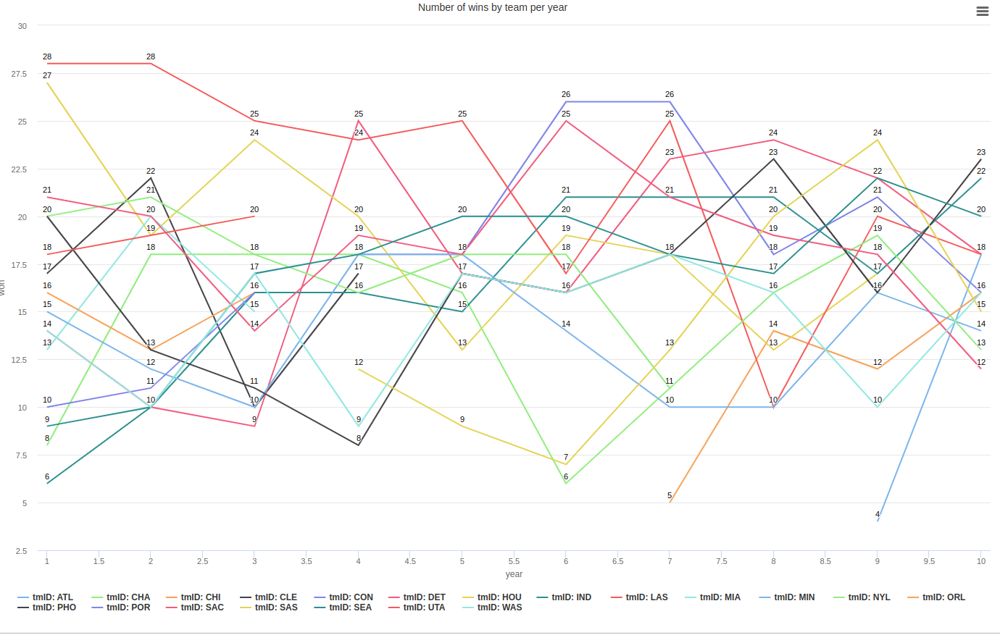
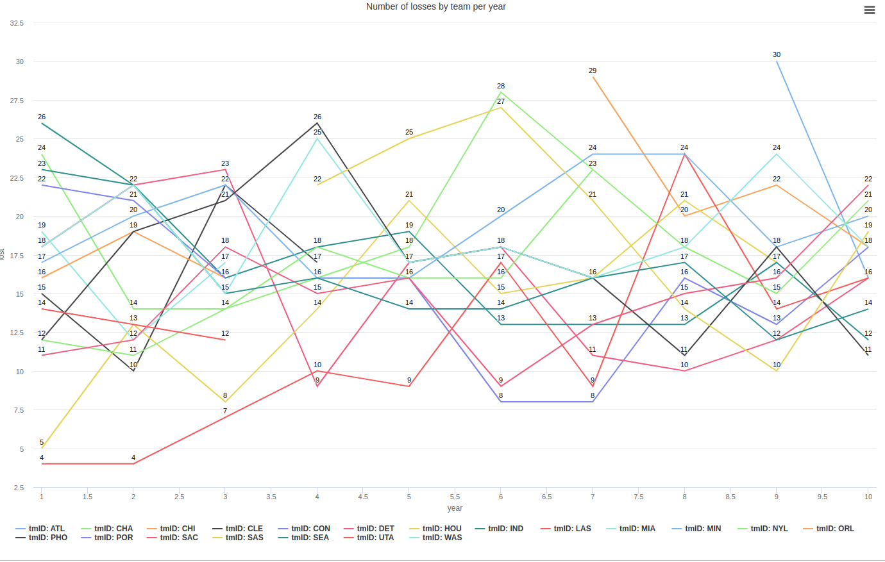
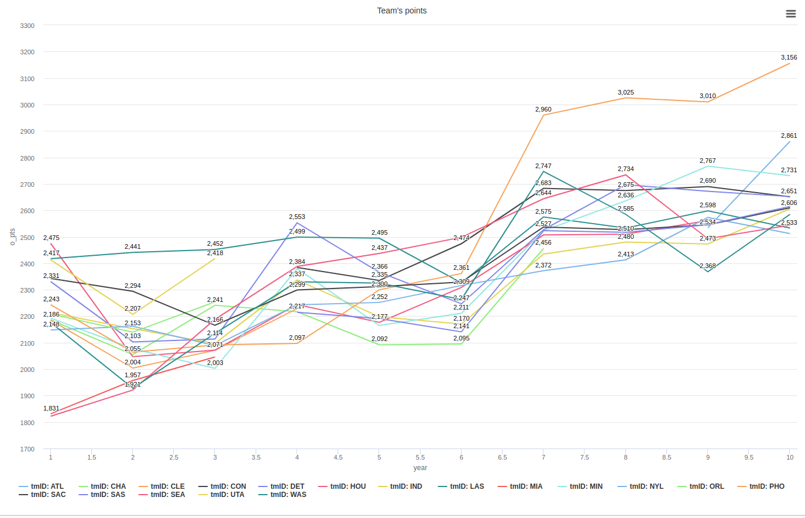
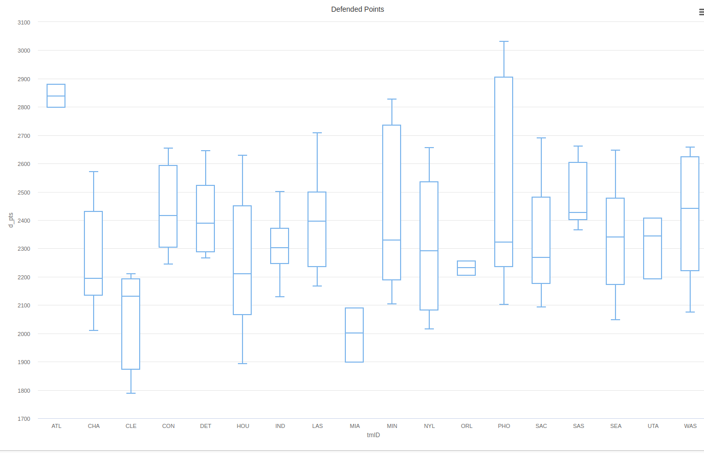
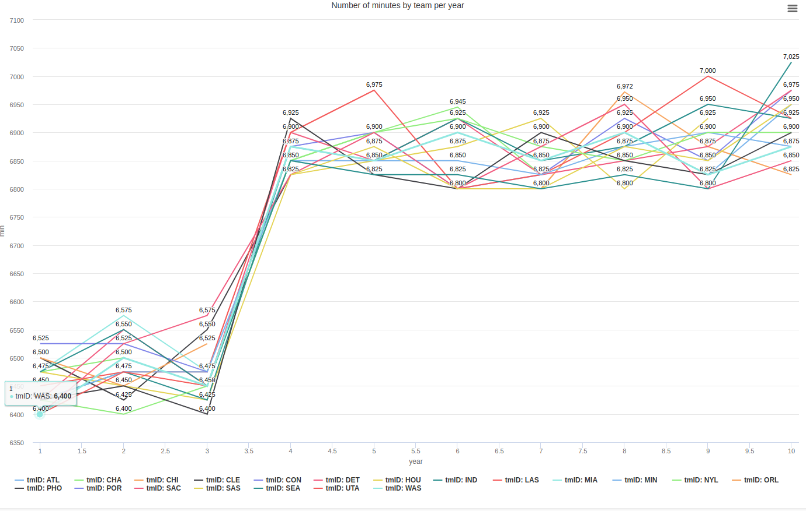
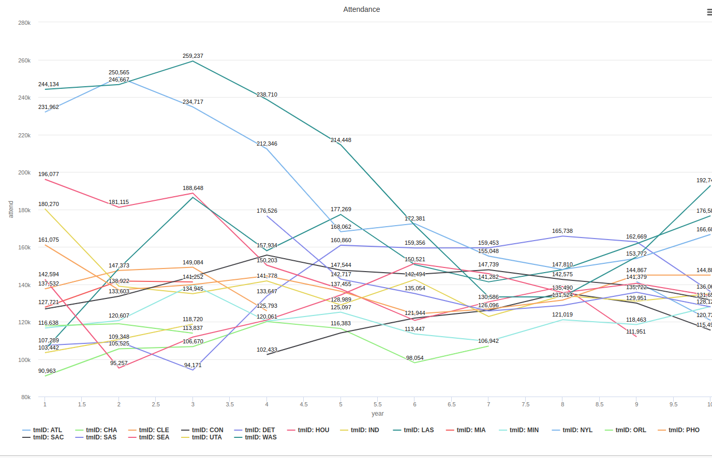
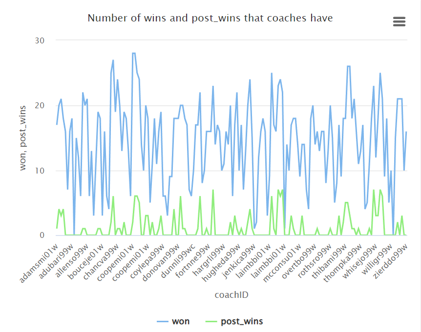
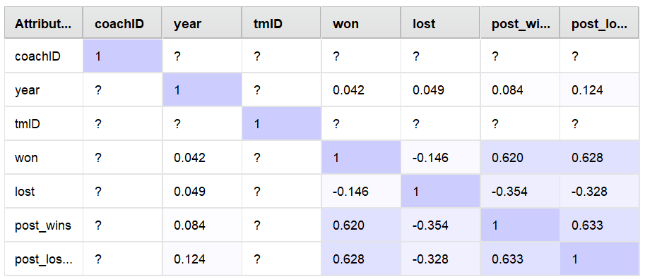

# AC
Machine Learning Project

## Group Members:

- Inês Sá Pereira Estevão Gaspar (up202007210@edu.fe.up.pt)
- Lourenço Alexandre Correia Gonçalves (up202004816@edu.fe.up.pt)
- Pedro Pereira Ferreira (up202004986@edu.fe.up.pt)

## Project Description

- Basketball tournaments are usually split in two parts. First, all teams play each other aiming to achieve the greatest number of wins possible. Then, at the end of the first part of the season, a pre determined number of teams which were able to win the most games are qualified to the playoff season, where they play series of knock-out matches for the trophy.

- For the 10 years, data from players, teams, coaches, games and several other metrics were gathered and arranged on this dataset. 

- The goal is to use this data to predict which teams will qualify for the playoffs in the next season.

## Business Understanding

### Business Objectives

- Our goal is to predict correctly which teams will classify to the playoffs in the next season, by creating a predictive model that uses that data given.

### Assess Situation

- Since we are beginning to work (20/09/2023) on this project, we don't have any previous knowledge about the data, so we will have to explore it and understand it before we can start working on it.

### Determine Data Mining Goals

- Since we are beginning to work (20/09/2023) on this project,we can't define in this moment clear objectives to achive with our data mining model.

### Produce Project Plan

- We're planning our project in this way:

1) Study Data

2) Convert Data (CSV to SQL)

3) Data Exploration

4) Data Preparation

5) Data Modelling

6) Evaluation

7) Deployment

### Data

- These are the classes of our dataset

#### teams_post
| Attribute  | Type         | Meaning                         |
|------------|--------------|---------------------------------|
| year       | INT          | Year of the basketball season   |
| tmID       | VARCHAR(255) | Team ID                         |
| lgID       | VARCHAR(255) | League ID                       |
| W          | INT          | Number of wins                  |
| L          | INT          | Number of losses                |

#### coaches
| Attribute  | Type         | Meaning                         |
|------------|--------------|---------------------------------|
| coachID    | VARCHAR(255) | Coach ID                        |
| year       | INT          | Year of coaching                |
| tmID       | VARCHAR(255) | Team ID                         |
| lgID       | VARCHAR(255) | League ID                       |
| stint      | INT          | Coaching stint                  |
| won        | INT          | Number of wins as a coach       |
| lost       | INT          | Number of losses as a coach     |
| post_wins  | INT          | Number of postseason wins       |
| post_losses| INT          | Number of postseason losses     |

#### teams
| Attribute  | Type         | Meaning                          |
|------------|--------------|----------------------------------|
| year       | INT          | Year of the basketball season    |
| lgID       | VARCHAR(255) | League ID                        |
| tmID       | VARCHAR(255) | Team ID                          |
| franchID   | VARCHAR(255) | Franchise ID                     |
| confID     | VARCHAR(255) | Conference ID                    |
| divID      | VARCHAR(255) | Division ID                      |
| rank       | INT          | Team's rank                      | 
| playoff    | VARCHAR(255) | Playoff status                   | 
| seeded     | INT          | Seeded position in playoffs      |
| firstRound | VARCHAR(255) | First round result               |
| semis      | VARCHAR(255) | Semifinals result                |
| finals     | VARCHAR(255) | Finals result                    |
| name       | VARCHAR(255) | Team name                        |
| o_fgm      | INT          | Overall field goals made         |
| o_fga      | INT          | Overall field goals attempted    |
| o_ftm      | INT          | Overall free throws made         |
| o_fta      | INT          | Overall free throws attempted    |
| o_3pm      | INT          | Overall three-pointers made      |
| o_3pa      | INT          | Overall three-pointers attempted |
| o_oreb     | INT          | Overall offensive rebounds       |
| o_dreb     | INT          | Overall defensive rebounds       |
| o_reb      | INT          | Overall total rebounds           |
| o_asts     | INT          | Overall assists                  |
| o_pf       | INT          | Overall personal fouls           |
| o_stl      | INT          | Overall steals                   |
| o_to       | INT          | Overall turnovers                |
| o_blk      | INT          | Overall blocks                   |
| o_pts      | INT          | Overall points                   |
| d_fgm      | INT          | Defended field goals made        |
| d_fga      | INT          | Defended field goals attempted   |
 
#### series_post
| Attribute  | Type         | Meaning                         |
|------------|--------------|---------------------------------|
| year       | INT          | Year of the basketball season   |
| round      | VARCHAR(255) | Playoff round                   |
| series     | VARCHAR(255) | Series name                     |
| tmIDWinner | VARCHAR(255) | Winning team's ID               |
| lgIDWinner | VARCHAR(255) | Winning team's league ID        |
| tmIDLoser  | VARCHAR(255) | Losing team's ID                |
| lgIDLoser  | VARCHAR(255) | Losing team's league ID         |
| W          | INT          | Number of wins in the series    |
| L          | INT          | Number of losses in the series  |

#### players_teams
| Attribute  | Type         | Meaning                         |
|------------|--------------|---------------------------------|
| playerID   | VARCHAR(255) | Player ID                       |
| year       | INT          | Year of the basketball season   |
| stint      | INT          | Player's stint with the team    |
| tmID       | VARCHAR(255) | Team ID                         |
| ldID       | VARCHAR(255) | League ID                       |
| GP         | INT          | Games played                    |
| GS         | INT          | Games started                   |
| minutes    | INT          | Total minutes played            |
| points     | INT          | Total points scored             |
| oRebounds  | INT          | Offensive rebounds              |
| dRebounds  | INT          | Defensive rebounds              |
| rebounds   | INT          | Total rebounds                  |
| assists    | INT          | Total assists                   |
| steals     | INT          | Total steals                    |
| blocks     | INT          | Total blocks                    |
| turnovers  | INT          | Total turnovers                 |
| PF         | INT          | Personal fouls                  |
| fgAttempted| INT          | Field goals attempted           |
| fgMade     | INT          | Field goals made                |
| ftAttempted| INT          | Free throws attempted           |
| ftMade     | INT          | Free throws made                |
| threeAttempted | INT     | Three-pointers attempted        |
| threeMade  | INT          | Three-pointers made             |
| dq         | INT          | Disqualifications                |
| PostGP     | INT          | Postseason games played         |
| PostGS     | INT          | Postseason games started        |
| PostMinutes| INT          | Total postseason minutes        |
| PostPoints | INT          | Total postseason points         |
| PostoRebounds | INT      | Total postseason offensive rebounds |
| PostdRebounds | INT      | Total postseason defensive rebounds |

#### players
| Attribute  | Type         | Meaning                         |
|------------|--------------|---------------------------------|
| bioID      | VARCHAR(255) | Player's bio ID                 |
| pos        | VARCHAR(255) | Player's position               |
| firstseason| INT          | First season played in          |
| lastseason | INT          | Last season played in           |
| height     | FLOAT        | Player's height in inches       |
| weight     | INT          | Player's weight in pounds       |
| college    | VARCHAR(255) | College attended                |
| collegeOther| VARCHAR(255)| Other colleges attended         |
| birthDate  | VARCHAR(255) | Date of birth                   |
| deathDate  | VARCHAR(255) | Date of death (if applicable)   |

#### awards_players
| Attribute  | Type         | Meaning                         |
|------------|--------------|---------------------------------|
| playerID   | VARCHAR(255) | Player ID                       |
| award      | VARCHAR(255) | Award received by the player    |
| year       | INT          | Year in which the award was received |
| lgID       | VARCHAR(255) | League ID in which the award was

### Data understanding

- Since we have our dataset in CSV, it would be useful to transform the information into SQL, so that we can use it to make more complex queries and extract more information with our data.

- So, we made a script that collects the CSV's' data and writes in our "database.sql" file, which we will use to make our queries.

- But first we need to visualize the data we had.

### Data Visualization

- We decide to make some graphs about the data we had, so we can have a better understanding of it.

#### Teams

- The most relevant attributes in the team's dataset are the number of wins and losses and all the games' statistics, such as points made, steals, blocks, etc. during the season. Besides that, some statistics are interesting in terms of prediction.

- If we see the wins and losses in the teams_post relation, as well as the if they won or not in first round, semi-finals and finals, we could conclude that we had some data leakage, since we are trying to predict if a team will classify to the playoffs, and we have the information if they won or not in the playoffs season. As a result, this information refers about a period of time after the the playoffs. As a result, we will not use these variables.

- Also, since they all had the same league and division' ID, the same value for seed for all the teams, and the conference and the franchise the teams have is not relevant, we decided to eliminate those attributes, since they don't give us any relevant information.

- Here's some graphs about the teams dataset:

- Ranks: we could extract better informations if they were by year and by team.

- Wins and Losses: We made an Line Chart about the whole season's records, where each line represents a team. We feel the Home Wins and Losses, as well as Away Wins and Losses are higly correlated with the Wins and Losses, so we will not use them. It is shown below the victories and the defeats by each team in the last 10 years, respectively.

- Overall statistics: Since we had several overall statistics, we chose to do a boxplot chart to see the evolution of the teams' points over the these 10-year period. Even though we knew that free-throws, assists, 3-points and field-points are correlated to the "points" variable, we decided to keep them.

- Defensive statistics: We also had several defensive statistics, so we decided to do a boxplot chart to see the evolution of the teams' points defended over the these 10-year period. Even though we knew that defensive rebounds, offensive rebounds, steals, blocks and turnovers are correlated to the "points" variable, we decided to keep them.

- We concluded that in these variable there is some teams that varies a lot from the others, so we will have to take that into account when we are making our models.

- Another relevant statistic is the number of minutes played by each team, so we decided to do a boxplot chart to see the evolution of the teams' minutes played over the these 10-year period. We chose this one instead of the games played, due to the fact that there is a small variation of the games played, so the minutes would be a better statistic to use.

- We also decided to see the evolution of the fan's attendance in the games, so we did a linechart to see the evolution of the teams' attendance over the these 10-year period.

- We chose not to use the teams_post relation due to the data leakage effect of its attributes.

#### Coaches
- In this dataset, all the data was organized and normalized, so there was no need to use a technique or treatment for outliers and missing values. With regard to analyzing the data in terms of relevance to the prediction we wanted to make, we excluded only two columns: stints and lgID, since the leagues are the same for all the coaches and would therefore not be differentiating factors. The remaining attributes bring value to the predictions in the sense that they are based on the number of wins and losses of each coach, and are therefore directly related to the probability of their team qualifying for the playoffs or not.

- In terms of correlated attributes, we mad the correlation matrix to analyse this metric and we conclude that none of the attributes of this dataset is correlated to each other.

#### Award Player
- This dataset contains few attributes, so from our analysis they are all relevant except for the information about the leagues, since as in the previous dataset this information is the same for all lines and therefore has no influence on differentiating results.
- We thought that one way of integrating this information about players and coaches who have won awards into the corresponding tables would be to add a column to the player and coach tables with Boolean values to inform whether or not a player or coach has won an award. This data is useful in the sense that an award-winning player or coach brings a lot of value to the team and therefore increases the likelihood of leading it to victory.
- From our analysis, there are no correlated attributes either, so it wasn't necessary to eliminate any more columns. However it is not possible to show the correlation matrix because the number os attributes is not enough.

### Data Preparation

#### Data Cleaning

- After analyzing the datasets provided, we noticed that some would need to be processed before we could analyze the relevant variables to take into account for our forecasting models.
- We decided to use RapidMiner for the data processing tool, as it would be quicker to obtain the clean csv and it is a tool that has already been used by all the members of the group, so everyone is comfortable with it for this stage of the project.
- So we divided up the datasets among the three team members. The following had to be dealt with:
    - eliminate duplicates
    - checking for undefined values and/or outliers and normalize/replace them
    - eliminating rows that were not used or related to any other table, as they had all the values missing

#### Feature extraction (feature selection)

- In this part, we were selecting the variables we want to consider in our models. We did some scripts in Python and used RapidMiner to build the correlation matrixes of the attributes of each relation, so we could see which ones were more correlated with each other and the target value.

